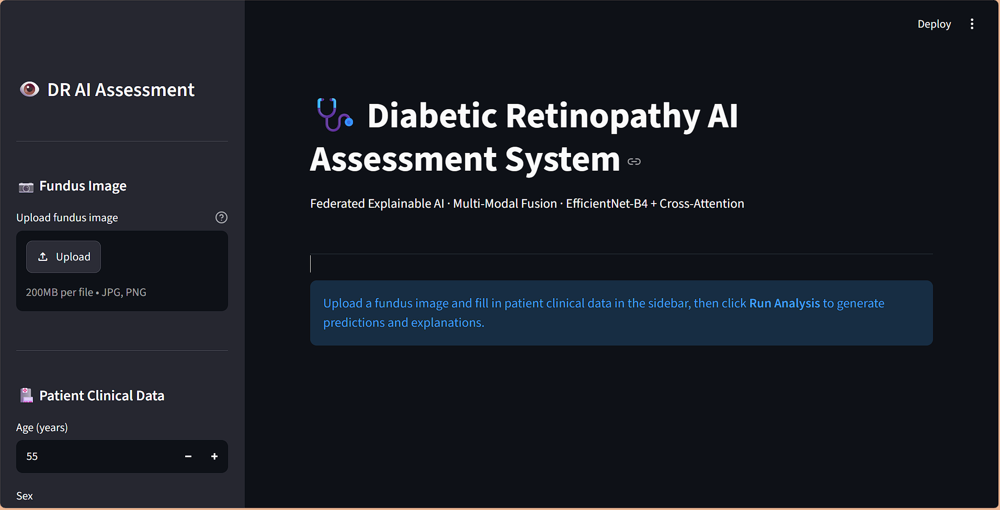
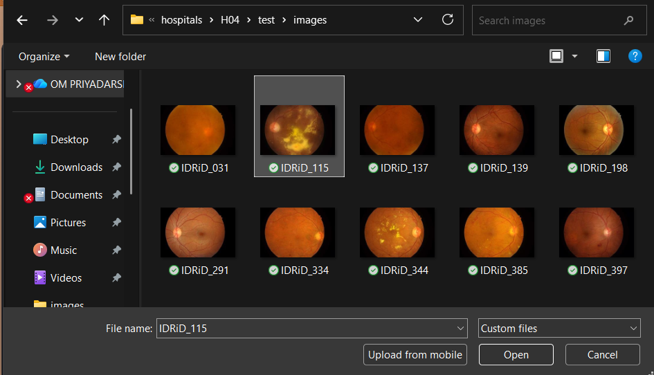

# 🩺 Diabetic Retinopathy AI Assessment System

A deep learning-based diabetic retinopathy assessment system that combines retinal fundus image analysis with clinical tabular information. The project integrates **multimodal learning, federated learning, and explainable AI** into a Streamlit-based application.

## 🚀 Project Overview

Diabetic Retinopathy (DR) is a diabetes-related eye disease that can lead to vision impairment and blindness if not detected and managed early.

This project develops an AI-assisted framework for analyzing retinal fundus images and clinical information using deep learning.

The system combines:

- 🖼️ Retinal fundus image analysis
- 📊 Clinical/tabular feature processing
- 🧠 Deep learning-based feature extraction
- 🔗 Multimodal feature fusion
- 🌐 Federated learning
- 🔍 Explainable AI
- 💻 Streamlit web application

The objective is to demonstrate how medical AI can combine multiple data modalities while preserving a federated-learning workflow and providing interpretable predictions.

---

## ✨ Key Features

### 🖼️ Fundus Image Analysis
Processes retinal fundus images using image preprocessing and a pretrained CNN backbone.

### 📊 Multimodal Learning
Combines image-derived features with structured clinical information.

### 🌐 Federated Learning
Simulates multiple hospital nodes and trains a shared global model without directly combining raw hospital datasets.

Implemented approaches:

- FedAvg
- FedProx

### 🔍 Explainable AI

The system provides model explanations using:

- **Grad-CAM** — highlights important regions in retinal images.
- **SHAP** — analyzes the contribution of clinical/tabular features.

### 💻 Streamlit Application

A user-friendly Streamlit interface allows users to interact with the trained model and obtain AI-assisted predictions.

---

# 🧠 Model Architecture

```text
                    RETINAL FUNDUS IMAGE
                            │
                            ▼
                   EfficientNet-B4
                    Pretrained CNN
                            │
                            ▼
                   Image Embedding
                       1792-d
                            │
                            ▼
                  Cross-Attention Fusion
                            ▲
                            │
                   Tabular Embedding
                       128-d
                            ▲
                            │
                 MLP: 256 → 128
                            ▲
                            │
                    CLINICAL DATA
                            │
                            ▼
                    Fused Representation
                         512-d
                            │
                ┌───────────┴───────────┐
                ▼                       ▼
          Grade Prediction       Progression Prediction
             5 Classes                 Risk Score
                │                       │
                └───────────┬───────────┘
                            ▼
                    Explainable AI
                 ┌──────────┴──────────┐
                 ▼                     ▼
              Grad-CAM               SHAP

# 📷 Application Screenshots

## 🏠 Application Interface



## 📤 Fundus Image Upload



## 🧠 Prediction Result


## 🔍 Explainable AI


---

## License

Research use only.